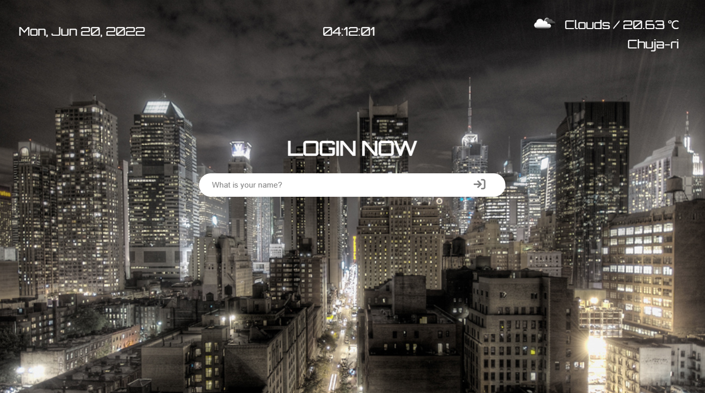
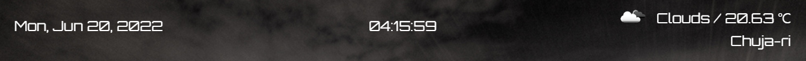
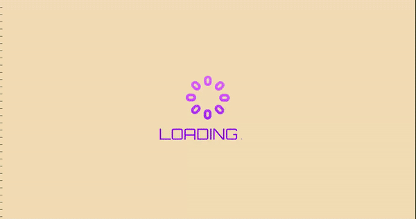

# ToDo List App

## What is the todo list app

ToDo List is an app that helps users manage todos.

## Demo URL

```
https://sangwl9.github.io/ToDo-List/
```

## Representative Functions

- Login and Logout

  Provide a function that the user can log in with the name. After logging in, you can see the sign-out button at the bottom right of the todo list screen. You can log out by clicking the button.
  Login | Logout
  :-------------------------:|:-------------------------:
   | 

- Manage ToDos

  After logging in, you can see a screen that you can add todo. If you add a todo, it is added on the screen. You can delete a todo by clicking the 'X' button to the right of todo. Scrolls are created when the added todo is out of a specific part of the screen.
  ToDos | ToDos with Scroll
  :-------------------------:|:-------------------------:
   | 

- Date, Clock, and Weather

  You can always check the Date, Clock, and Weather on the top of the screen. Display today's date on the left, the current clock in the middle, and the current temperature, location, weather, and weather icon on the right.
  Date, Clock, and Weather|
  :-------------------------:
  

- Loading Screen

  Because the image of the background is large, it is in Google Drive, and the web browser downloads the image from Google Drive every time. So, I added a loading screen to wait because the web browser needs time to fetch the background. I implemented the loading screen by adding a function to the onload. The onload executes the function after all elements of the body are ready. Here's the code: (js/background.js)

  ```javascript
  body.onload = removeSplashScreen;
  ```

  By giving onload removeSplashScreen (a function to add an animation effect that the loading screen disappears), the loading screen disappears after the body is loaded.
  Loading Screen|
  :-------------------------:
  

## Future Improvements

- Sign Up

  I will improve to manage todo according to the user by adding the signup function. Now anyone can log in, and todo is not saved according to the user.
